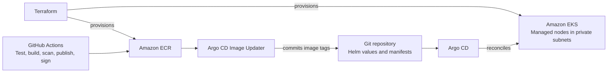

# Amazon EKS Platform with Terraform and GitOps

An AWS Kubernetes platform built with Terraform and operated through GitOps.
The project covers VPC networking, EKS cluster provisioning, workload identity,
automated delivery, canary releases, and centralized monitoring.

The OpenTelemetry demo provides a distributed workload for exercising the
platform under traffic. Terraform manages AWS infrastructure; Argo CD keeps
Kubernetes controllers, monitoring, and application workloads in sync with Git.

- **AWS infrastructure:** Terraform modules provision a VPC with public and
  private subnets across two availability zones, NAT gateways, an EKS managed
  node group, ECR repositories, IAM roles, and Secrets Manager resources.
  Cluster add-ons manage networking, DNS, pod identity, metrics, and EBS storage.
  Terraform state uses an encrypted, versioned S3 backend with state locking.
- **Networking and access:** Worker nodes run in private subnets. The AWS Load
  Balancer Controller exposes the demo through an Application Load Balancer.
  Default-deny NetworkPolicies allow explicitly defined workload connections.
  EKS Pod Identity grants AWS permissions to controllers and add-ons; External
  Secrets synchronizes values from AWS Secrets Manager into Kubernetes.
- **GitOps operations:** Argo CD uses an App-of-Apps setup to manage platform
  components and the demo Helm chart. Automated synchronization, pruning, and
  self-healing reconcile the cluster with the configuration in Git.
- **CI and image delivery:** GitHub Actions runs service tests and Trivy image
  scans, then publishes images to ECR with immutable commit-SHA tags, SBOMs,
  and build provenance. Cosign signs and verifies the published image digests.
  CI authenticates to AWS through GitHub OIDC; Argo CD Image Updater writes new
  image tags back to Helm values in Git.
- **Progressive delivery:** Argo Rollouts and Istio shift traffic through
  10%, 25%, and 50% canary stages before full promotion. Prometheus analysis
  checks canary request volume, error rate, and p95 latency, aborting a rollout
  when analysis fails. The Payment workload exercises this release strategy.
- **Observability:** The OpenTelemetry Collector exposes application metrics
  for Prometheus and forwards logs to Loki. Grafana provides Platform Health
  and Application RED (request rate, errors, duration) dashboards, with alert
  rules for unavailable deployments, pod restarts, errors, and latency.
- **Persistent storage:** The EBS CSI managed add-on provisions encrypted
  volumes through the default gp3 StorageClass, with volume expansion enabled.
  Loki uses a 5Gi volume and retains logs for 72 hours.

| Path | Purpose |
| --- | --- |
| [terraform/](terraform/) | AWS networking, EKS, IAM, registries, secrets, and state bootstrap |
| [platform/](platform/) | Argo CD applications, cluster controllers, storage, and monitoring |
| [helm/otel-demo/](helm/otel-demo/) | Demo workloads, network policies, and canary configuration in `dev` |
| [.github/workflows/](.github/workflows/) | Service tests, image scanning, ECR publishing, and signing |
| [src/](src/) | Payment, Product Catalog, and Recommendation sources; other services use upstream images |

To recreate the environment:

1. Adapt AWS account, IAM role, and repository settings in Terraform, platform
   manifests, Helm values, and GitHub Actions repository variables.
2. [Bootstrap the Terraform backend](terraform/bootstrap/README.md), then plan
   and apply the main [Terraform configuration](terraform/).
3. Populate Secrets Manager values, publish the initial application images to
   ECR, and set their commit-SHA tags in [Helm values](helm/otel-demo/values.yaml).
4. Install Argo CD using the [repository values](platform/argocd/values.yaml)
   and register the [root Application](platform/argocd/root-application.yaml)
   to synchronize the platform and demo workloads.

This configuration targets a development environment. Traces generate service
metrics but have no storage backend. Loki runs a single replica without backups,
and node autoscaling is not configured. Production use would require durable log
storage, backups, and availability planning. Before destroying the cluster,
delete workload PVCs while the EBS CSI driver is still running.
