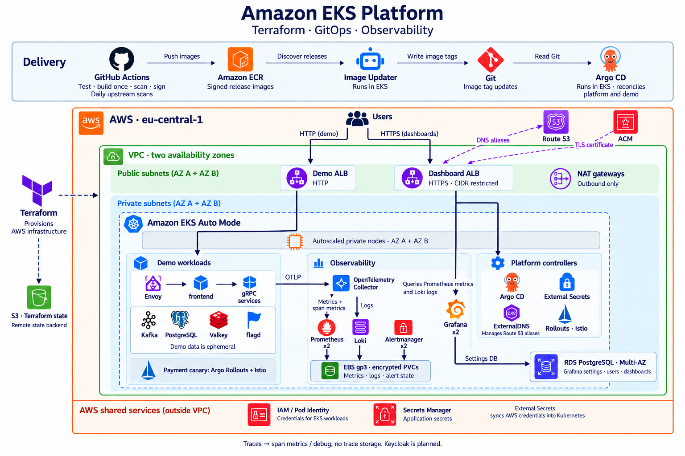

# Amazon EKS Platform with Terraform and GitOps

An AWS platform for running the OpenTelemetry demo and practicing automated
delivery, progressive rollouts and observability. The configuration targets
`eu-central-1` across two availability zones.

- **Infrastructure:** Terraform provisions a VPC, private EKS Auto Mode nodes,
  NAT gateways, ECR repositories, IAM and Secrets Manager. Terraform state uses
  encrypted, versioned S3 storage with locking. Auto Mode manages compute,
  networking, load balancing and EBS provisioning.
- **Delivery:** Argo CD reconciles the platform and demo from Git. GitHub Actions
  tests services, scans one image build, then publishes and signs that artifact.
  Image Updater writes successful release tags back to Git. Infrastructure CI
  validates Terraform, Helm manifests and workflows.
- **Application:** The demo combines gRPC services, Kafka order events,
  PostgreSQL product/order data, Valkey carts and feature flags. Payment uses
  Argo Rollouts and Istio for canary releases checked by Prometheus.
- **Observability:** OpenTelemetry feeds Prometheus metrics and Loki logs;
  Grafana provides dashboards and alerts. Monitoring data uses encrypted EBS
  volumes. Two Grafana replicas share a private Multi-AZ RDS PostgreSQL database
  for settings, users and dashboards.
- **Access and availability:** Grafana and Argo CD use a shared HTTPS ALB with
  ACM certificates, a CIDR allowlist and Route 53 records managed by ExternalDNS.
  Selected workloads use replicas and disruption budgets. Pod Identity and
  External Secrets supply AWS access and credentials outside Git.

| Directory | Contents |
| --- | --- |
| [terraform/](terraform/) | AWS infrastructure and state bootstrap |
| [platform/](platform/) | GitOps applications and platform configuration |
| [helm/otel-demo/](helm/otel-demo/) | Demo workloads, dependencies and environment values |
| [src/](src/) | Maintained Payment, Product Catalog and Recommendation services |
| [.github/](.github/) | CI, validation and release automation |

To bootstrap, configure AWS/GitHub inputs, apply Terraform, populate the demo
secrets and initial images, then install Argo CD with the repository values and
apply its root Application. GitOps initializes Grafana's database login and
deploys the remaining platform.

This is a development/portfolio environment. Demo PostgreSQL, Kafka and Valkey
data are ephemeral; the demo ingress uses public HTTP. Keycloak integration is
planned, and traces currently produce metrics/debug output without a searchable
trace backend. Review the current deployment blockers before starting AWS resources.
